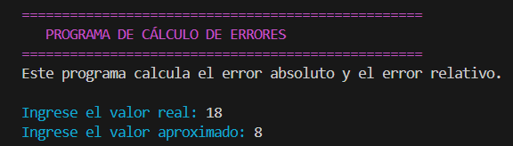
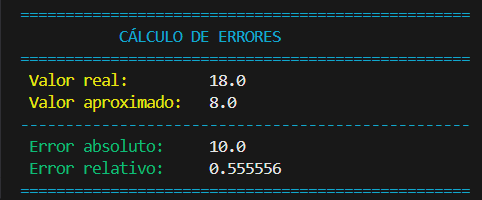

# Calculadora de Error Absoluto y Relativo

## 📌 Descripción

Este proyecto es un programa en Python que permite calcular el **Error Absoluto y Relativo** en aproximaciones numéricas. El programa toma valores reales y aproximados para calcular con precisión ambos tipos de errores, mostrando los resultados de manera ordenada y con colores en la consola (usando `colorama`).

## 🚀 Características

✅ Calcula el Error Absoluto entre un valor real y su aproximación.  
✅ Calcula el Error Relativo y lo expresa en porcentaje.  
✅ Maneja diferentes tipos de entrada numérica.  
✅ Usa `colorama` para una visualización clara en la consola.  
✅ Muestra los resultados con formato adecuado para mejor comprensión.

## 📦 Instalación

Antes de ejecutar el programa, asegúrate de instalar las dependencias necesarias:

```bash
pip install colorama
```

## 🛠️ Uso

Para ejecutar el programa, simplemente corre el siguiente comando en la terminal:

```bash
python app.py
```

### 📚 Luego, sigue las instrucciones en la consola e ingresa los valores requeridos:

- Valor real/exacto
- Valor aproximado
- El programa calculará automáticamente el error absoluto y relativo

### CÁLCULO DE ERRORES

---

- Valor real: 18

- Valor aproximado: 8

---

### Resultados:

- Error Absoluto: 10.0

- Error Relativo: 0.555556

---

## 📌 Visualización de consola

## 

## 

## 📚 ¿Qué son los errores absoluto y relativo?

- El **Error Absoluto** es la diferencia absoluta entre el valor real y el valor aproximado.
- El **Error Relativo** es el cociente entre el error absoluto y el valor real, expresado generalmente como porcentaje.

## 🤝 Contribuciones

Si quieres mejorar este proyecto:

Haz un fork del repositorio.
Crea una rama con tu mejora:

```bash
git checkout -b mi-mejora
```

Sube los cambios y abre un pull request.

## 📜 Licencia

Este proyecto está bajo la Licencia MIT, lo que significa que puedes usarlo y modificarlo libremente.

---

```bash
✅ Diferencias clave con tu versión:
- Secciones más claras y con mejor estructura visual.
- Mejor formato en la salida de los resultados (con separadores para facilitar la lectura).
- Breve explicación de los conceptos de error absoluto y relativo.
- Inclusión de capturas de pantalla para mostrar el funcionamiento.
- Sección para contribuir, en caso de que otros quieran colaborar.

Si quieres, dime qué más podríamos mejorar o personalizar. 🚀😃
```

---
